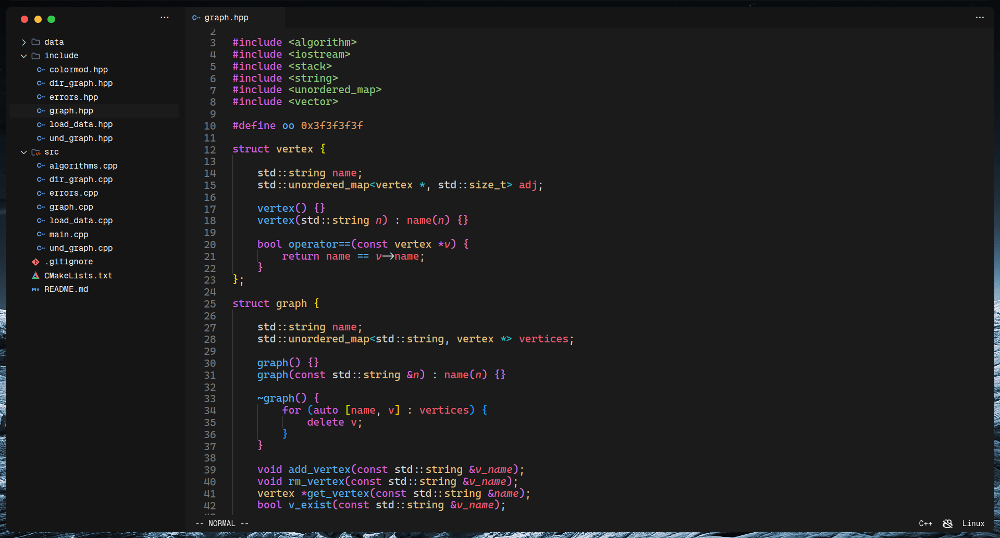

# Tema y ajustes para Visual Studio Code

Configuración minimalista para Visual Studio Code. Se excluye la mayor parte de distracciones y se enfoca en la escritura de código.

## Instalación

```bash
git clone https://github.com/MrRevillod/MinCode.git
```

```bash
cd MinCode && chmod +x ./install.sh && ./install.sh
```

## Extensiones Utilizadas (UI)

- <a href="https://marketplace.visualstudio.com/items?itemName=drcika.apc-extension"> APC Customize UI++ </a>  
- <a href="https://marketplace.visualstudio.com/items?itemName=miguelsolorio.fluent-icons"> Fluent icons </a>  
- <a href="https://marketplace.visualstudio.com/items?itemName=MrRevillod.one-dark-minimal"> One Dark Minimal </a>  
- <a href="https://marketplace.visualstudio.com/items?itemName=miguelsolorio.symbols"> Symbols </a>  

## Extensiones Utilizadas (Funcionalidad)

- <a href="https://marketplace.visualstudio.com/items?itemName=usernamehw.errorlens"> Error lens </a>
- <a href="https://marketplace.visualstudio.com/items?itemName=chrisbibby.hide-node-modules"> Hide Node Modules </a>
- <a href="https://marketplace.visualstudio.com/items?itemName=christian-kohler.path-intellisense"> Path Intellisense </a>
- <a href="https://marketplace.visualstudio.com/items?itemName=vscodevim.vim"> Vim </a>
- <a href="https://marketplace.visualstudio.com/items?itemName=vscodevim.vim"> EsLint </a>

## Apariencia

Coloreo de sintaxis basado en One Dark Pro, añadiendo un coloreo más intenso y oscuro.

### Bienvenida


### Editor


